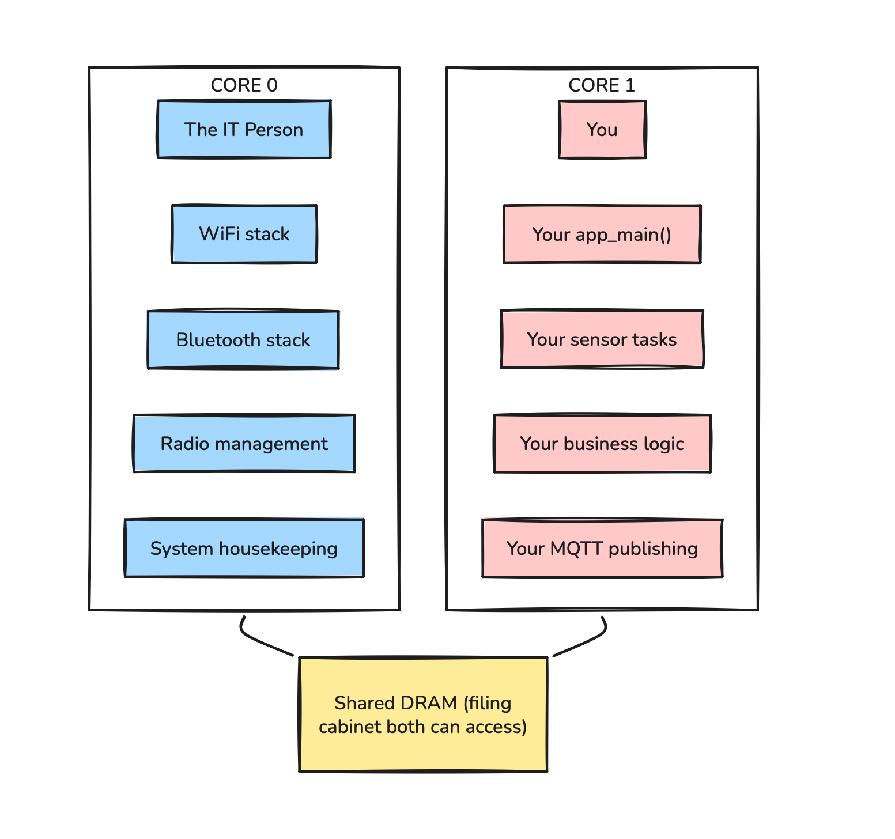
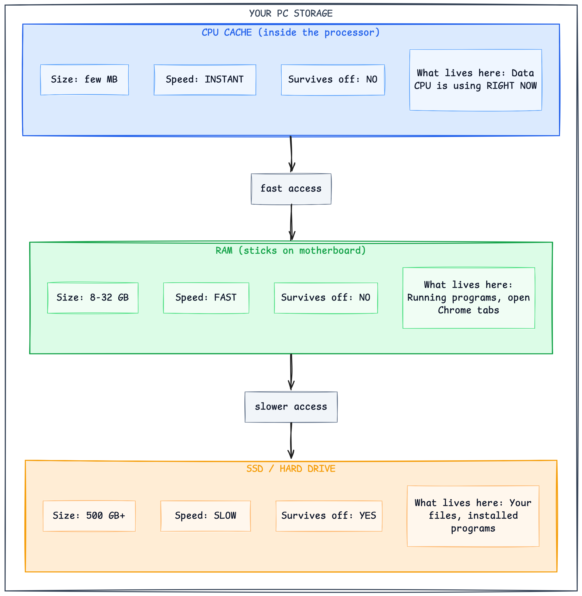
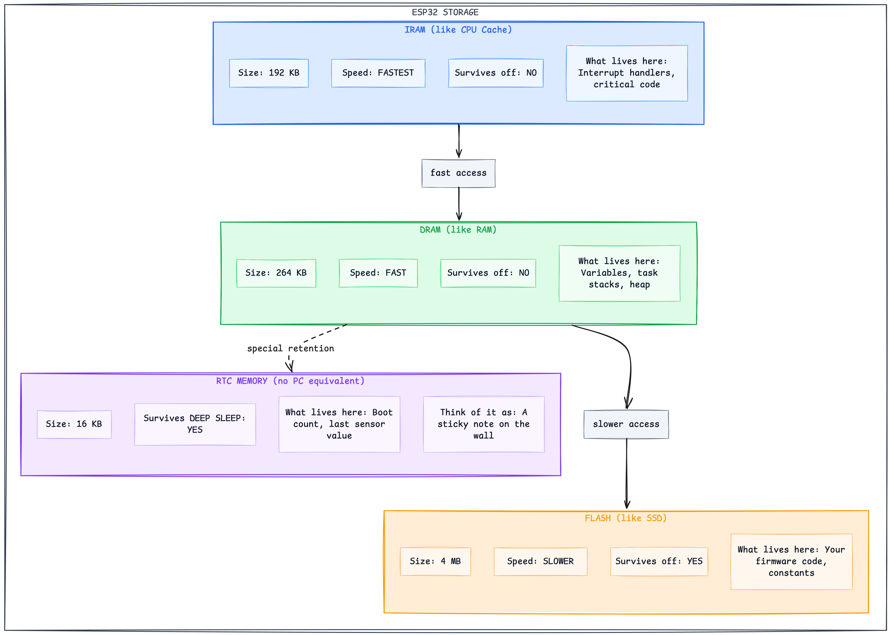
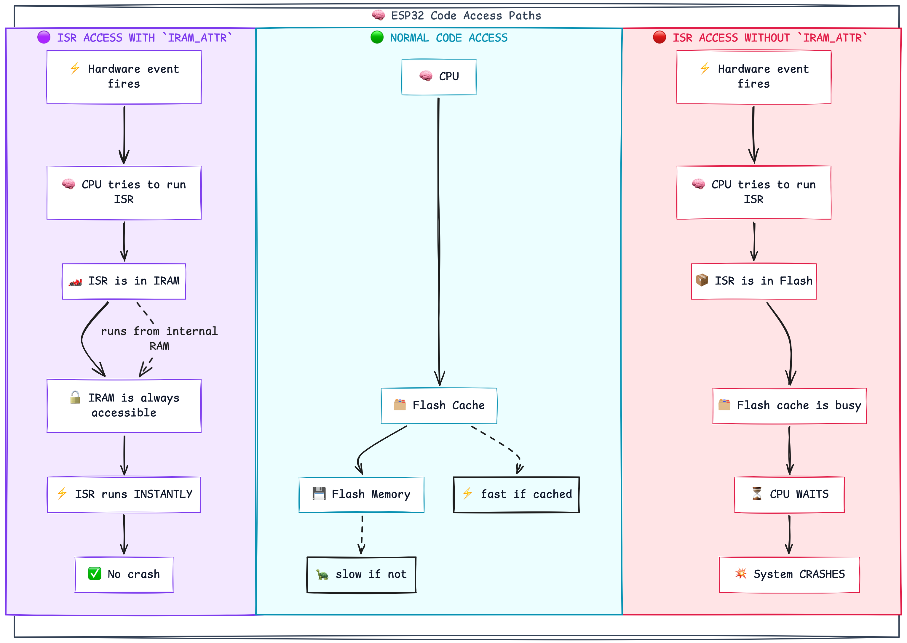
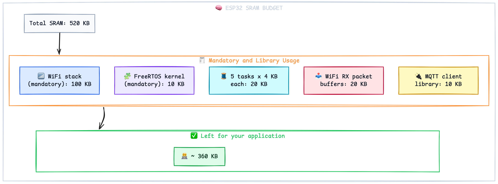
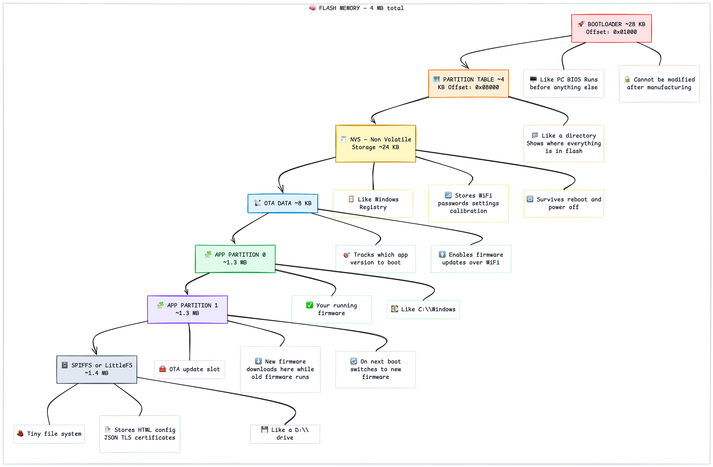
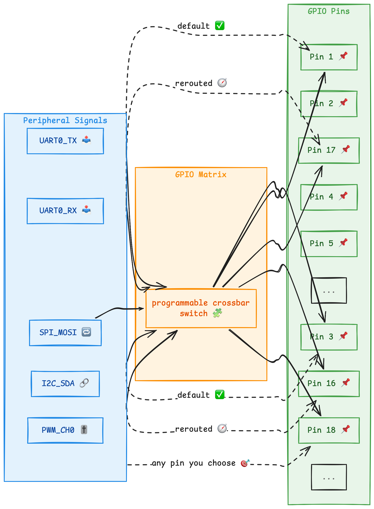
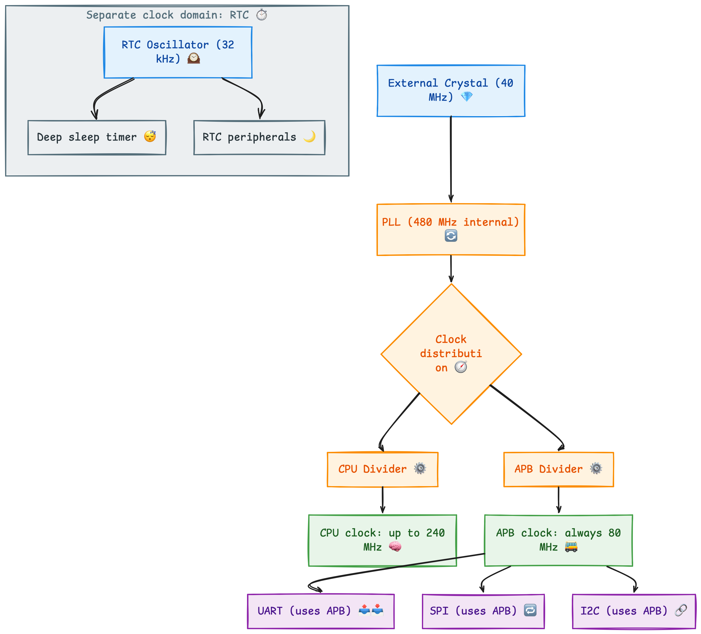
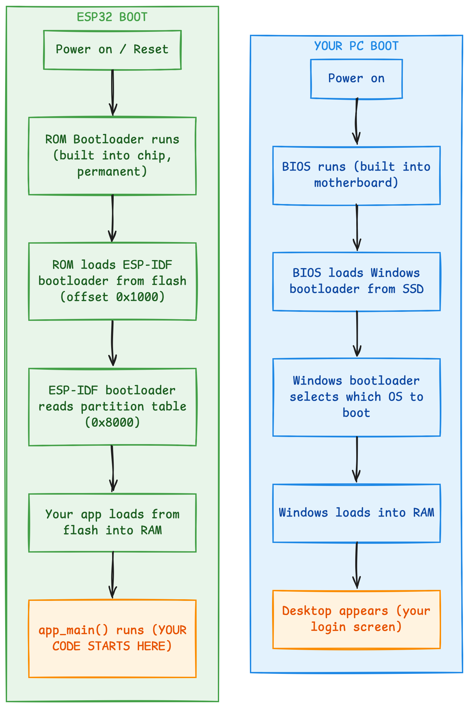
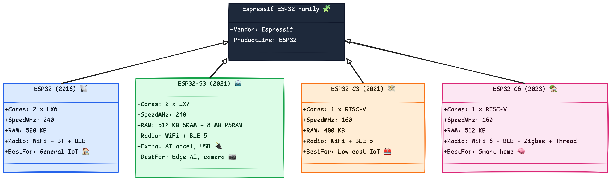

# ESP32 Architecture - Session Notes

---

## 1. What Is the ESP32?

You already own a computer — your laptop or desktop. The ESP32 is also a computer. Just a very, very small one.

Here is everything inside your PC mapped to what is inside the ESP32:

|Your PC|ESP32|
|---|---|
|Intel / AMD CPU|Xtensa LX6 processor|
|8 GB RAM|520 KB SRAM (15,000x less)|
|500 GB SSD|4 MB Flash (125,000x less)|
|WiFi card (separate chip)|Built-in WiFi radio (on same chip)|
|Dedicated GPU|Not present|
|Motherboard (many chips)|Everything on one tiny chip|
|300W power supply|Runs on 3.3V — milliwatts|
|Costs ₹50,000+|Costs ₹200|

The ESP32 does far less than your PC — but it does exactly what an IoT product needs, uses almost no power, costs ₹200 and fits on your fingertip.

---

## 2. The Two Brains — Dual Core

The ESP32 has **two processors running simultaneously**, called Core 0 and Core 1.

### The Office Analogy

Think of an office with two desks and two people:



Both cores run at up to 240 MHz. Your PC runs at 3,000-5,000 MHz. The ESP32 is about 15x slower but uses milliwatts instead of 300 watts.

### Key Numbers

|Property|Value|
|---|---|
|Number of cores|2|
|Architecture|Xtensa LX6|
|Maximum speed|240 MHz|
|Your PC speed|3,000 to 5,000 MHz|
|Power usage|Milliwatts|
|Your PC power usage|~300 Watts|

### Core Pinning in Code

```c
// Runs on whichever core has free time
xTaskCreate(my_task, "task", 4096, NULL, 5, NULL);

// Forced to Core 0 — alongside WiFi stack
xTaskCreatePinnedToCore(wifi_task, "wifi", 4096, NULL, 5, NULL, 0);

// Forced to Core 1 — your application core
xTaskCreatePinnedToCore(sensor_task, "sensor", 4096, NULL, 5, NULL, 1);
```

**Production rule:** Keep WiFi-heavy tasks on Core 0. Keep your application logic on Core 1.

---

## 3. Memory — The Most Important Concept in Embedded

### Step 1 — Your PC Has Three Types of Storage



### Step 2 — The ESP32 Has the Same Three Types


### Step 3 — Quick Reference Table

|Memory|Size|Speed|Survives Power Off|PC Equivalent|
|---|---|---|---|---|
|IRAM|192 KB|Fastest|No|CPU L1 Cache|
|DRAM|264 KB|Fast|No|RAM|
|RTC Fast|8 KB|Fast|Yes (sleep only)|Sticky note|
|RTC Slow|8 KB|Slower|Yes (sleep only)|Sticky note|
|Flash (code)|up to 4 MB|Slower|Yes|SSD installed app|
|Flash (data)|up to 4 MB|Slower|Yes|SSD saved files|
|PSRAM (optional)|4 to 8 MB|Medium|No|Extra RAM stick|

### The IRAM Rule — Never Break This

Interrupt handlers (ISRs) MUST be placed in IRAM. Here is why:



```c
// WRONG — ISR in flash — will crash randomly in production
void gpio_isr_handler(void *arg) {
    xQueueSendFromISR(queue, &gpio_num, NULL);
}

// CORRECT — IRAM_ATTR places function in IRAM
void IRAM_ATTR gpio_isr_handler(void *arg) {
    xQueueSendFromISR(queue, &gpio_num, NULL);
}
```

**Rule:** Every ISR must have `IRAM_ATTR`. No exceptions.

### RTC Memory — The Sticky Note

```c
// WITHOUT RTC_DATA_ATTR:
int boot_count = 0;
// After deep sleep -> boot_count resets to 0 every time

// WITH RTC_DATA_ATTR:
RTC_DATA_ATTR int boot_count = 0;
// After deep sleep -> boot_count keeps its value
```

---

## 4. Why 520 KB Fills Up Fast



On your PC you have 8 GB — be as wasteful as you like. On the ESP32 you have 520 KB — every byte matters.

**Always monitor your heap:**

```c
// How much heap is free right now
ESP_LOGI(TAG, "Free heap: %lu", esp_get_free_heap_size());

// Lowest heap has ever been since boot
ESP_LOGI(TAG, "Min heap: %lu", esp_get_minimum_free_heap_size());

// How much stack this task has left
ESP_LOGI(TAG, "Stack left: %d", uxTaskGetStackHighWaterMark(NULL));
```

If minimum free heap keeps dropping — you have a memory leak. Fix it before shipping.

---

## 5. Flash Memory Layout — Partitions

Your 4 MB flash is divided into partitions — exactly like C:\ and D:\ on your PC:



### Partition Reference Table

|Partition|Size|Purpose|PC Equivalent|
|---|---|---|---|
|Bootloader|~28 KB|Starts the chip|BIOS / UEFI|
|Partition table|~4 KB|Flash directory|MBR / GPT|
|NVS|~24 KB|Config storage|Windows Registry|
|OTA data|~8 KB|Version tracking|Windows Update metadata|
|App partition 0|~1.3 MB|Running firmware|C:\Windows|
|App partition 1|~1.3 MB|OTA update slot|Windows staging folder|
|SPIFFS|~1.4 MB|File storage|D:\ drive|

---

## 6. Peripherals — The Ports of the ESP32

|PC Port|ESP32 Equivalent|
|---|---|
|USB port|UART (serial data)|
|Ethernet / WiFi|Built-in WiFi radio|
|HDMI / DisplayPort|SPI (for display modules)|
|3.5mm audio jack|I2S (digital audio)|
|Unknown sensor port|I2C (sensors, OLEDs, RTCs)|
|Power button and LEDs|GPIO (general purpose pins)|
|Volume knob|ADC (reads analog voltages)|
|Speaker output|DAC (outputs analog voltage)|
|Bluetooth dongle|Built-in BLE radio|

### The GPIO Matrix

On your PC — HDMI is always video. USB is always USB. Fixed forever.

On the ESP32 — any signal can go to almost any pin through a programmable switch:



```c
// UART0 on default pins: TX=1, RX=3
uart_set_pin(UART_NUM_0, 1, 3, -1, -1);

// Rerouted to different pins: TX=17, RX=16
uart_set_pin(UART_NUM_0, 17, 16, -1, -1);
```

One line of code. No hardware changes. This saves enormous effort during PCB design.

---

## 7. The Clock System



### CPU Speed Options

|Speed|Mode|Use Case|
|---|---|---|
|240 MHz|Maximum performance|WiFi + heavy processing|
|160 MHz|Balanced|General use|
|80 MHz|Power saving|Simple tasks|
|40 MHz|Ultra low power|Battery devices|

**Key point:** APB is always 80 MHz regardless of CPU speed. All peripheral timing — UART baud rate, I2C speed, SPI frequency — is calculated from APB, not CPU speed.

---

## 8. Boot Sequence



### What ESP-IDF Does Before app_main()

|Done by ESP-IDF|What it means for you|
|---|---|
|Initialised all clocks|CPU already running at 240 MHz|
|Set up memory system|IRAM, DRAM, cache all ready|
|Started FreeRTOS|Scheduler already running|
|Created main task|Your code has a task context|
|Initialised WiFi hardware|Radio ready — not connected yet|
|Set up logging|ESP_LOGI works from line 1|

You start in a fully initialised environment. No manual setup needed.

---

## 9. What Happens When It Crashes

```
  YOUR PC CRASH              ESP32 CRASH
  -------------              -----------
  Blue Screen of Death       Guru Meditation Error
  BSOD                       (yes, that is the real name)
```

Example crash output:

```
  Guru Meditation Error: Core 0 panic'ed (LoadProhibited)

  Core 0 register dump:
  PC : 0x400d1234    <-- where in code the crash happened

  Backtrace:
  0x400d1234:0x3ffb0000    <-- chain of function calls
  0x400d5678:0x3ffb0020       that led to the crash
```

### Crash Types Reference Table

|ESP32 Crash|What it means|PC Equivalent|
|---|---|---|
|LoadProhibited|Reading from invalid memory|App crash — null pointer|
|StoreProhibited|Writing to invalid memory|Buffer overflow|
|Task watchdog|A task was stuck and did not yield|Windows Not Responding|
|Stack overflow|Task ran out of stack space|Stack overflow|
|Heap corruption|Wrote past end of malloc buffer|Memory corruption|
|Brownout reset|Power supply voltage too low|PC shut down by UPS|

**Rule:** Read the crash message before changing anything. It tells you exactly what went wrong.

---

## 10. Reset Reasons

Every startup — ask the ESP32 why it restarted:

```c
void app_main(void) {

    // Put this first — before anything else in app_main
    esp_reset_reason_t reason = esp_reset_reason();

    switch (reason) {
        case ESP_RST_POWERON:
            ESP_LOGI(TAG, "Fresh power on");
            break;
        case ESP_RST_BROWNOUT:
            ESP_LOGW(TAG, "Low voltage — check power supply");
            break;
        case ESP_RST_TASK_WDT:
            ESP_LOGE(TAG, "Task was stuck — watchdog reset");
            break;
        case ESP_RST_PANIC:
            ESP_LOGE(TAG, "Firmware crashed — check coredump");
            break;
        case ESP_RST_DEEPSLEEP:
            ESP_LOGI(TAG, "Woke from deep sleep");
            break;
        default:
            ESP_LOGI(TAG, "Reset reason: %d", reason);
    }
}
```

### Reset Reason Reference Table

|Constant|What happened|Action needed|
|---|---|---|
|ESP_RST_POWERON|Fresh start|Normal|
|ESP_RST_EXT|Reset button pressed|Normal|
|ESP_RST_SW|Code called esp_restart()|Normal|
|ESP_RST_PANIC|Firmware crash|Check coredump|
|ESP_RST_TASK_WDT|Task was stuck|Find blocking task|
|ESP_RST_BROWNOUT|Low voltage|Fix power supply|
|ESP_RST_DEEPSLEEP|Woke from sleep|Normal|

---

## 11. ESP32 Chip Family




### Chip Comparison Table

|Feature|ESP32|ESP32-S3|ESP32-C3|ESP32-C6|
|---|---|---|---|---|
|CPU cores|2|2|1|1|
|Architecture|Xtensa LX6|Xtensa LX7|RISC-V|RISC-V|
|Max speed|240 MHz|240 MHz|160 MHz|160 MHz|
|Internal RAM|520 KB|512 KB|400 KB|512 KB|
|External PSRAM|Optional|8 MB|No|No|
|WiFi standard|802.11 b/g/n|802.11 b/g/n|802.11 b/g/n|WiFi 6|
|Bluetooth|BT + BLE 4.2|BLE 5.0|BLE 5.0|BLE 5.0|
|Zigbee / Thread|No|No|No|Yes|
|Native USB|No|Yes|No|No|
|AI acceleration|No|Yes|No|No|
|GPIO count|34|45|22|30|
|Best use case|General IoT|Edge AI, camera|Low cost nodes|Smart home|

---

## Complete Summary Table

|Concept|What it is|PC Equivalent|
|---|---|---|
|ESP32|Complete computer on a chip|Miniaturised laptop|
|Core 0|System processor|Background OS services|
|Core 1|Application processor|Your running apps|
|IRAM|Fastest code memory — ISRs go here|CPU L1 cache|
|DRAM|General purpose memory|RAM|
|Flash|Permanent storage|SSD|
|NVS|Config key-value store|Windows Registry|
|RTC memory|Survives deep sleep|Battery-backed CMOS|
|GPIO|Digital input/output pins|USB and HDMI ports|
|GPIO Matrix|Any signal to any pin|Software-defined ports|
|Partition table|Flash layout map|Disk partition table|
|Bootloader|Pre-app startup code|BIOS / UEFI|
|Boot sequence|Startup process|Power on to Windows|
|Guru Meditation|Firmware crash|Blue Screen of Death|
|Reset reason|Why it restarted|Windows Event Viewer|
|Task watchdog|Stuck task detector|Windows Not Responding|
|IRAM_ATTR|Place function in fast RAM|Compiler directive|
|RTC_DATA_ATTR|Survive deep sleep|Persistent variable|
|APB clock|Peripheral timing base|System bus clock|

---

_Analog Data | analogdata.io | ESP32 Production Firmware Workshop_