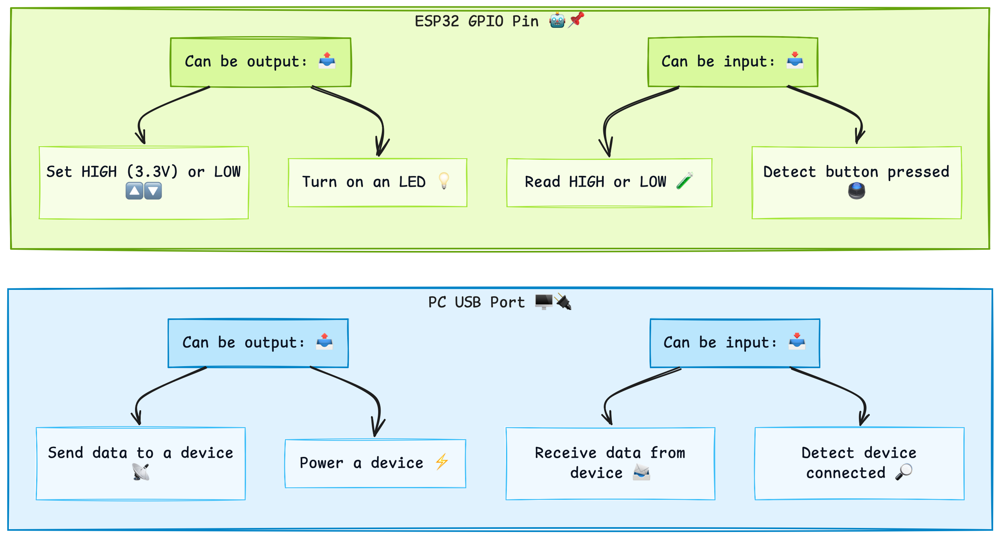
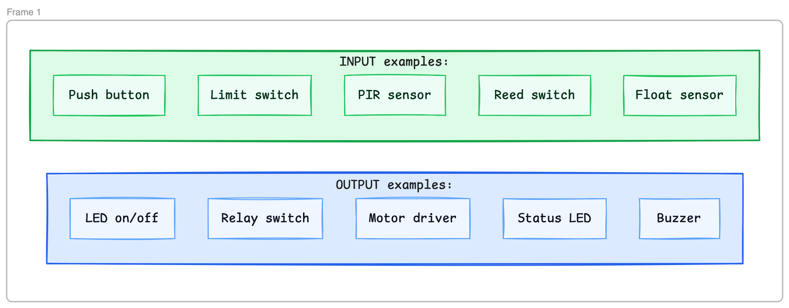
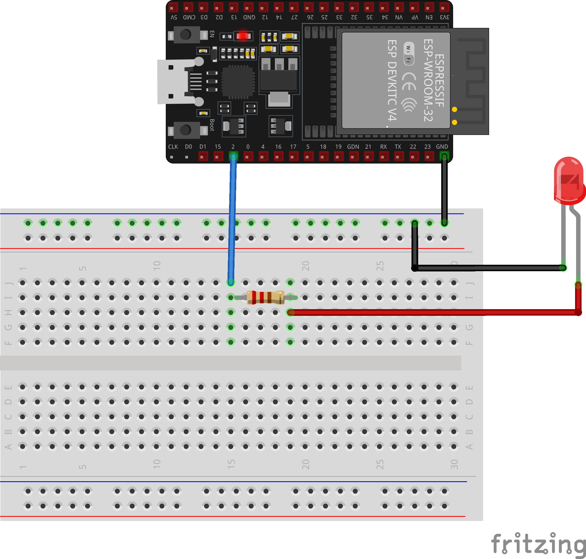
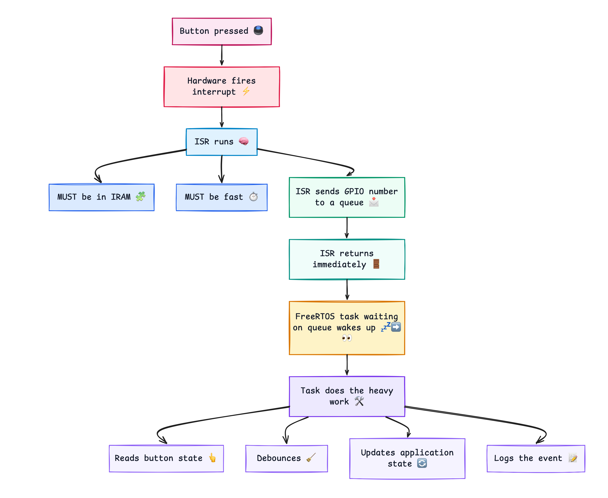
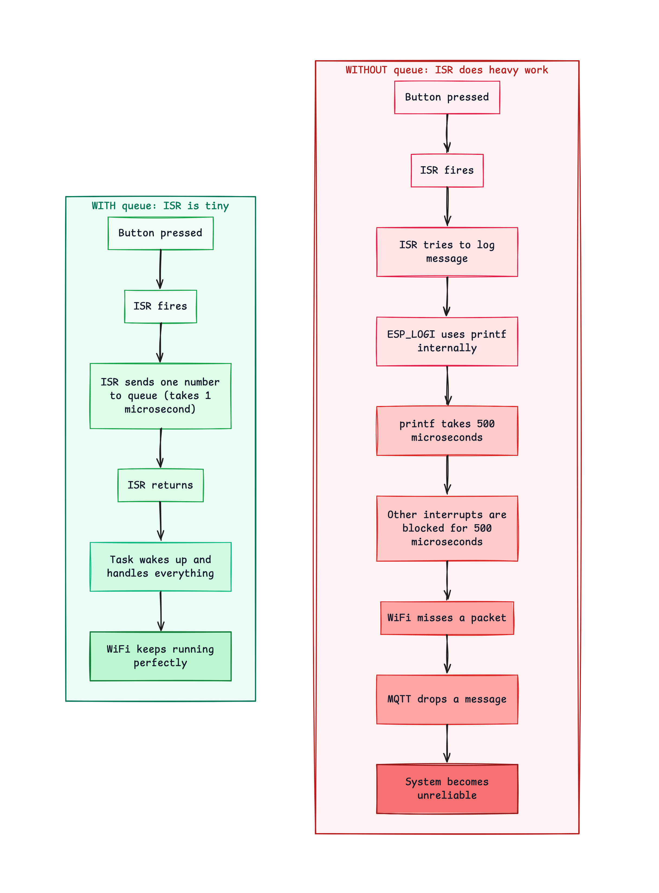

#  GPIO Production Patterns

---

## 1. What Is GPIO?

GPIO stands for General Purpose Input Output.

Every pin on your ESP32 board that is not dedicated to power is a GPIO pin. You can configure each one as either:

- An **output** — you control its voltage (HIGH or LOW)
- An **input** — you read its voltage (HIGH or LOW)

### PC Analogy

Think of GPIO pins like USB ports on your PC:



The difference is that USB has a protocol on top. GPIO is raw voltage. HIGH = 3.3V. LOW = 0V. That is all.
### What GPIO Controls



---

## 2. Arduino GPIO vs ESP-IDF GPIO

This is the first thing to unlearn.

### Arduino Way

```c
// Arduino
void setup() {
    pinMode(2, OUTPUT);        // Configure pin 2 as output
    pinMode(0, INPUT_PULLUP);  // Configure pin 0 as input
}

void loop() {
    digitalWrite(2, HIGH);     // Set pin 2 HIGH
    int state = digitalRead(0); // Read pin 0
}
```

This works. But it hides everything. You do not know what registers are being set. You cannot configure interrupts easily. You cannot configure multiple pins efficiently.

### ESP-IDF Way

```c
// ESP-IDF
gpio_config_t output_config = {
    .pin_bit_mask = (1ULL << GPIO_NUM_2),
    .mode         = GPIO_MODE_OUTPUT,
    .pull_up_en   = GPIO_PULLUP_DISABLE,
    .pull_down_en = GPIO_PULLDOWN_DISABLE,
    .intr_type    = GPIO_INTR_DISABLE
};
gpio_config(&output_config);

gpio_set_level(GPIO_NUM_2, 1);  // HIGH
gpio_set_level(GPIO_NUM_2, 0);  // LOW

int state = gpio_get_level(GPIO_NUM_0); // Read
```

More lines — but look at what you gain:

|Feature|Arduino|ESP-IDF|
|---|---|---|
|Configure multiple pins at once|No|Yes — use bit mask|
|Interrupt configuration|Separate|In same struct|
|Pull-up / pull-down control|Limited|Explicit|
|ISR registration|Complex|Built in|
|Production reliability|Lower|Higher|
|Code clarity|Hidden|Explicit|

---

## 3. The gpio_config_t Struct

The core of ESP-IDF GPIO is the configuration struct. Understand this and everything else follows naturally.

```c
gpio_config_t config = {
    .pin_bit_mask = (1ULL << GPIO_NUM_2),   // Which pins
    .mode         = GPIO_MODE_OUTPUT,        // Direction
    .pull_up_en   = GPIO_PULLUP_DISABLE,     // Internal pull-up
    .pull_down_en = GPIO_PULLDOWN_DISABLE,   // Internal pull-down
    .intr_type    = GPIO_INTR_DISABLE        // Interrupt type
};
esp_err_t ret = gpio_config(&config);
```

### Each Field Explained

**pin_bit_mask** — which pins to configure

```c
// Single pin
.pin_bit_mask = (1ULL << GPIO_NUM_2)

// Multiple pins at once — pin 2 AND pin 4 AND pin 5
.pin_bit_mask = (1ULL << GPIO_NUM_2) |
                (1ULL << GPIO_NUM_4) |
                (1ULL << GPIO_NUM_5)
```

PC analogy: configuring multiple USB ports at the same time instead of one by one.

**mode** — direction of the pin

|Value|Meaning|
|---|---|
|GPIO_MODE_OUTPUT|Output only|
|GPIO_MODE_INPUT|Input only|
|GPIO_MODE_INPUT_OUTPUT|Both (open-drain)|
|GPIO_MODE_OUTPUT_OD|Output open-drain|
|GPIO_MODE_DISABLE|Disabled|

**pull_up_en and pull_down_en** — internal resistors

```
Internal pull-up resistor:
                 3.3V
                  |
              [10kΩ]   <- Pull-up resistor (inside the chip)
                  |
    GPIO_PIN -----+---- your circuit
```

When nothing is connected to the pin — the pull-up holds it HIGH. When a button pulls it to GND — it reads LOW. This is how most buttons work.

**intr_type** — when to fire an interrupt

|Value|Meaning|
|---|---|
|GPIO_INTR_DISABLE|No interrupt|
|GPIO_INTR_POSEDGE|Rising edge — LOW to HIGH|
|GPIO_INTR_NEGEDGE|Falling edge — HIGH to LOW|
|GPIO_INTR_ANYEDGE|Both edges|
|GPIO_INTR_LOW_LEVEL|While pin is LOW|
|GPIO_INTR_HIGH_LEVEL|While pin is HIGH|

---

## 4. Output — Controlling an LED

### Wiring



### Code — LED Blink the Production Way

```c
#include "driver/gpio.h"
#include "freertos/FreeRTOS.h"
#include "freertos/task.h"
#include "esp_log.h"

static const char *TAG = "gpio_output";

#define LED_PIN    GPIO_NUM_2

static void led_init(void)
{
    gpio_config_t config = {
        .pin_bit_mask = (1ULL << LED_PIN),
        .mode         = GPIO_MODE_OUTPUT,
        .pull_up_en   = GPIO_PULLUP_DISABLE,
        .pull_down_en = GPIO_PULLDOWN_DISABLE,
        .intr_type    = GPIO_INTR_DISABLE
    };
    ESP_ERROR_CHECK(gpio_config(&config));
    ESP_LOGI(TAG, "LED initialised on GPIO %d", LED_PIN);
}

static void led_set(int state)
{
    gpio_set_level(LED_PIN, state);
}

void app_main(void)
{
    led_init();

    ESP_LOGI(TAG, "Starting LED blink");

    while (1) {
        led_set(1);
        ESP_LOGI(TAG, "LED ON");
        vTaskDelay(pdMS_TO_TICKS(500));

        led_set(0);
        ESP_LOGI(TAG, "LED OFF");
        vTaskDelay(pdMS_TO_TICKS(500));
    }
}
```

### What ESP_ERROR_CHECK Does

```c
ESP_ERROR_CHECK(gpio_config(&config));
```

This is the production error handling pattern:

```
Without ESP_ERROR_CHECK:
gpio_config(&config);
// If this fails — nothing happens. Silent failure.
// Your firmware runs but GPIO is not configured.
// Debugging this takes hours.

With ESP_ERROR_CHECK:
ESP_ERROR_CHECK(gpio_config(&config));
// If this fails — immediately logs the error and aborts.
// You know exactly which line failed and why.
// Debugging takes minutes.
```

**Rule:** Always wrap ESP-IDF API calls with `ESP_ERROR_CHECK` during development. In production you can handle errors gracefully — but during development, fail loud and fast.

---

## 5. Input — Reading a Button

### Wiring — Two Options

**Option 1 — External pull-down (most explicit):**

```
3.3V ---- [Button] ---- GPIO 0
                   |
                [10kΩ]
                   |
                  GND
```

When button open: GPIO reads LOW (pulled down) When button pressed: GPIO reads HIGH (connected to 3.3V)

**Option 2 — Internal pull-up (fewer components):**

```
GPIO 0 ---- [Button] ---- GND
```

When button open: GPIO reads HIGH (internal pull-up) When button pressed: GPIO reads LOW (connected to GND) This is the most common pattern on dev boards.

### Code — Button Polling (The Wrong Way First)

```c
// THIS WORKS BUT IS WRONG FOR PRODUCTION
void app_main(void)
{
    gpio_config_t btn_config = {
        .pin_bit_mask = (1ULL << GPIO_NUM_0),
        .mode         = GPIO_MODE_INPUT,
        .pull_up_en   = GPIO_PULLUP_ENABLE,
        .pull_down_en = GPIO_PULLDOWN_DISABLE,
        .intr_type    = GPIO_INTR_DISABLE
    };
    ESP_ERROR_CHECK(gpio_config(&btn_config));

    while (1) {
        int state = gpio_get_level(GPIO_NUM_0);
        if (state == 0) {
            ESP_LOGI(TAG, "Button pressed!");
        }
        vTaskDelay(pdMS_TO_TICKS(10));  // Poll every 10ms
    }
}
```

### Why Polling Is Wrong for Production

```
What polling looks like:

Timeline:
0ms   10ms  20ms  30ms  40ms  50ms  60ms
 |     |     |     |     |     |     |
 CHECK CHECK CHECK CHECK CHECK CHECK CHECK
       ^
       Button pressed here at 3ms
       Not detected until 10ms check
       7ms delay!

Problems:
1. You check the button at fixed intervals
2. You can miss very short button presses
3. The task MUST keep running even when nothing is happening
4. Uses CPU time constantly even when button never changes
5. Does not scale — add 5 more inputs and it gets messy fast
```

---

## 6. Input — Interrupts (The Right Way)

An interrupt is the CPU's way of saying: **"Stop what you are doing — something important just happened."**

### PC Analogy

Think of the difference between:

```
POLLING (wrong way):
You check your phone every 10 seconds to see if someone called.
"Any calls? No. Any calls? No. Any calls? No. Any calls? Yes!"
CPU is busy checking constantly.

INTERRUPT (right way):
Your phone rings when someone calls.
You do other work until the phone rings.
CPU does other work until the hardware fires the interrupt.
```

### The ISR-to-Task Queue Pattern

In ESP-IDF, interrupts cannot do heavy work directly. ISRs must be short, fast and simple. Heavy work is deferred to a FreeRTOS task via a queue.

```
Button pressed
      |
      v
Hardware fires interrupt
      |
      v
ISR runs (MUST be in IRAM, MUST be fast)
ISR sends GPIO number to a queue
ISR returns immediately
      |
      v
FreeRTOS task waiting on queue wakes up
Task does the heavy work:
  - Reads button state
  - Debounces
  - Updates application state
  - Logs the event
```


### Why the Queue?

```
WITHOUT queue — ISR does heavy work:

Button pressed
ISR fires
ISR tries to log message
ESP_LOGI uses printf internally
printf takes 500 microseconds
Other interrupts are blocked for 500 microseconds
WiFi misses a packet
MQTT drops a message
System becomes unreliable

WITH queue — ISR is tiny:

Button pressed
ISR fires
ISR sends one number to queue (takes 1 microsecond)
ISR returns
Task wakes up and handles everything
WiFi keeps running perfectly
```


### Code — Interrupt Driven Button

```c
#include <stdio.h>
#include "driver/gpio.h"
#include "freertos/FreeRTOS.h"
#include "freertos/task.h"
#include "freertos/queue.h"
#include "esp_log.h"

static const char *TAG = "gpio_interrupt";

#define LED_PIN     GPIO_NUM_2
#define BUTTON_PIN  GPIO_NUM_0

/* Queue to pass GPIO events from ISR to task */
static QueueHandle_t gpio_evt_queue = NULL;

/* ISR handler — MUST have IRAM_ATTR
   MUST be short and fast
   MUST NOT call any non-IRAM functions */
static void IRAM_ATTR button_isr_handler(void *arg)
{
    uint32_t gpio_num = (uint32_t) arg;
    xQueueSendFromISR(gpio_evt_queue, &gpio_num, NULL);
}

/* Task that processes GPIO events from the queue */
static void gpio_task(void *arg)
{
    uint32_t gpio_num;

    while (1) {
        /* Block here until something arrives in the queue
           portMAX_DELAY means wait forever */
        if (xQueueReceive(gpio_evt_queue, &gpio_num, portMAX_DELAY)) {

            int level = gpio_get_level(gpio_num);
            ESP_LOGI(TAG, "GPIO %lu changed — level: %s",
                     gpio_num,
                     level ? "HIGH" : "LOW");

            /* Toggle LED when button pressed */
            if (gpio_num == BUTTON_PIN && level == 0) {
                static int led_state = 0;
                led_state = !led_state;
                gpio_set_level(LED_PIN, led_state);
                ESP_LOGI(TAG, "LED toggled: %s",
                         led_state ? "ON" : "OFF");
            }
        }
    }
}

static void gpio_output_init(void)
{
    gpio_config_t config = {
        .pin_bit_mask = (1ULL << LED_PIN),
        .mode         = GPIO_MODE_OUTPUT,
        .pull_up_en   = GPIO_PULLUP_DISABLE,
        .pull_down_en = GPIO_PULLDOWN_DISABLE,
        .intr_type    = GPIO_INTR_DISABLE
    };
    ESP_ERROR_CHECK(gpio_config(&config));
}

static void gpio_input_init(void)
{
    gpio_config_t config = {
        .pin_bit_mask = (1ULL << BUTTON_PIN),
        .mode         = GPIO_MODE_INPUT,
        .pull_up_en   = GPIO_PULLUP_ENABLE,
        .pull_down_en = GPIO_PULLDOWN_DISABLE,
        .intr_type    = GPIO_INTR_NEGEDGE  // Fire on falling edge
    };
    ESP_ERROR_CHECK(gpio_config(&config));
}

void app_main(void)
{
    /* Create queue to hold GPIO event numbers
       10 = max events that can be queued
       sizeof(uint32_t) = size of each item */
    gpio_evt_queue = xQueueCreate(10, sizeof(uint32_t));

    /* Initialise GPIO */
    gpio_output_init();
    gpio_input_init();

    /* Install GPIO ISR service
       0 = default flags */
    ESP_ERROR_CHECK(gpio_install_isr_service(0));

    /* Register ISR handler for button pin
       Passes GPIO number as argument to the handler */
    ESP_ERROR_CHECK(gpio_isr_handler_add(
        BUTTON_PIN,
        button_isr_handler,
        (void *) BUTTON_PIN
    ));

    ESP_LOGI(TAG, "GPIO interrupt demo started");
    ESP_LOGI(TAG, "Press button on GPIO %d to toggle LED on GPIO %d",
             BUTTON_PIN, LED_PIN);

    /* Create task to process GPIO events
       Stack: 2048 bytes
       Priority: 10 (higher than default) */
    xTaskCreate(gpio_task, "gpio_task", 2048, NULL, 10, NULL);
}
```

---

## 7. Button Bounce — What It Is and How to Fix It

When you press a physical button — the metal contacts do not make clean contact immediately. They bounce 5–20 times in the first 5–20 milliseconds. Each bounce fires an interrupt.

```
What actually happens when you press a button:

Voltage
HIGH |  ____      __________
     |      |    |
     |      |    |
     |      |____|
LOW  |
     +----------------------------> time
          ^  ^ ^
          |  | |
          |  | Third bounce
          |  Second bounce
          First contact
          
Your code sees 3 interrupts instead of 1.
```

### Software Debounce in the Task

```c
static void gpio_task(void *arg)
{
    uint32_t gpio_num;
    static uint32_t last_press_time = 0;

    while (1) {
        if (xQueueReceive(gpio_evt_queue, &gpio_num, portMAX_DELAY)) {

            /* Get current time in milliseconds */
            uint32_t now = xTaskGetTickCount() * portTICK_PERIOD_MS;

            /* Ignore events within 50ms of the last one
               This filters out bounce events */
            if ((now - last_press_time) < 50) {
                continue;  // Skip this event — it is a bounce
            }

            last_press_time = now;

            /* Now handle the real button press */
            ESP_LOGI(TAG, "Button pressed (debounced)");
        }
    }
}
```

### Debounce Time Reference

|Debounce Time|Use Case|
|---|---|
|10–20 ms|High quality buttons|
|50 ms|Standard tactile switches|
|100 ms|Cheap buttons or long cable runs|
|200 ms|Very noisy environments|

---

## 8. Multiple GPIO — Configuring Several Pins at Once

One of the advantages of `gpio_config_t` over Arduino is configuring multiple pins in a single call using the bit mask:

```c
/* Configure GPIO 2, 4 and 5 all as outputs at once */
gpio_config_t multi_output = {
    .pin_bit_mask = (1ULL << GPIO_NUM_2) |
                    (1ULL << GPIO_NUM_4) |
                    (1ULL << GPIO_NUM_5),
    .mode         = GPIO_MODE_OUTPUT,
    .pull_up_en   = GPIO_PULLUP_DISABLE,
    .pull_down_en = GPIO_PULLDOWN_DISABLE,
    .intr_type    = GPIO_INTR_DISABLE
};
ESP_ERROR_CHECK(gpio_config(&multi_output));

/* Now control each independently */
gpio_set_level(GPIO_NUM_2, 1);
gpio_set_level(GPIO_NUM_4, 0);
gpio_set_level(GPIO_NUM_5, 1);
```

---

## 9. GPIO Hold — For Deep Sleep

When the ESP32 enters deep sleep, GPIO output states are lost by default. `gpio_hold_en` preserves the state:

```c
/* Set LED on */
gpio_set_level(GPIO_NUM_2, 1);

/* Hold the state through deep sleep */
gpio_hold_en(GPIO_NUM_2);

/* Enter deep sleep */
esp_deep_sleep_start();

/* On wake — LED is still on without any code */
```

This is essential for battery-powered devices where you want indicator LEDs to stay in a defined state during sleep.

---

## 10. Complete Production GPIO Pattern

This is the full pattern you will use in every production project:

```
+------------------------------------------------------+
|                  GPIO PRODUCTION PATTERN             |
|                                                      |
|  1. Define pin constants at the top of the file      |
|     #define LED_PIN   GPIO_NUM_2                     |
|     #define BTN_PIN   GPIO_NUM_0                     |
|                                                      |
|  2. Write an _init() function for each GPIO group    |
|     static void led_init(void) { ... }               |
|     static void button_init(void) { ... }            |
|                                                      |
|  3. Use gpio_config_t struct — never pinMode()       |
|                                                      |
|  4. Wrap all API calls with ESP_ERROR_CHECK()        |
|                                                      |
|  5. For inputs — always use interrupts not polling   |
|                                                      |
|  6. ISR handler:                                     |
|     - Must have IRAM_ATTR                            |
|     - Must be short (< 10 lines)                     |
|     - Must only call ISR-safe functions              |
|     - Send to queue — nothing else                   |
|                                                      |
|  7. Task:                                            |
|     - Receives from queue                            |
|     - Does all heavy work                            |
|     - Handles debounce                               |
|     - Updates application state                      |
|                                                      |
|  8. Never use vTaskDelay inside an ISR               |
|  9. Never use ESP_LOGI inside an ISR                 |
| 10. Never use malloc inside an ISR                   |
+------------------------------------------------------+
```

---

## Summary Table

|Concept|Arduino|ESP-IDF|Why It Matters|
|---|---|---|---|
|Pin configure|`pinMode()`|`gpio_config_t`|Explicit, supports batch config|
|Output set|`digitalWrite()`|`gpio_set_level()`|Same simplicity|
|Input read|`digitalRead()`|`gpio_get_level()`|Same simplicity|
|Interrupts|`attachInterrupt()`|`gpio_isr_handler_add()`|Proper ISR service|
|ISR safety|Not enforced|`IRAM_ATTR` required|Prevents random crashes|
|Debounce|Manual|Manual with tick count|Consistent pattern|
|Error handling|Hidden|`ESP_ERROR_CHECK`|Fail loud and fast|
|Multi-pin config|One by one|Bit mask — all at once|Efficient and clean|

---

_Analog Data | analogdata.io | ESP32 Production Firmware Workshop_